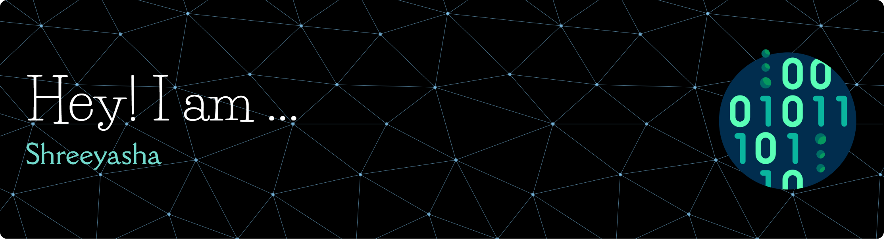

<h3 align="center"> Data Science | Modeling | Analytics | Automation </h3>

  

  <em>   
I am a Data science enthusiast with a curiosity for research and deep statistical analysis, a love for clean code, and a passion to find meaningful discoveries through data.
  </em> 
   

  

&nbsp;***About Me***

✔   
✔  
✔  
✔  
✔  
✔     

  &nbsp;***Tools I Use in My Projects***

  

  

  

